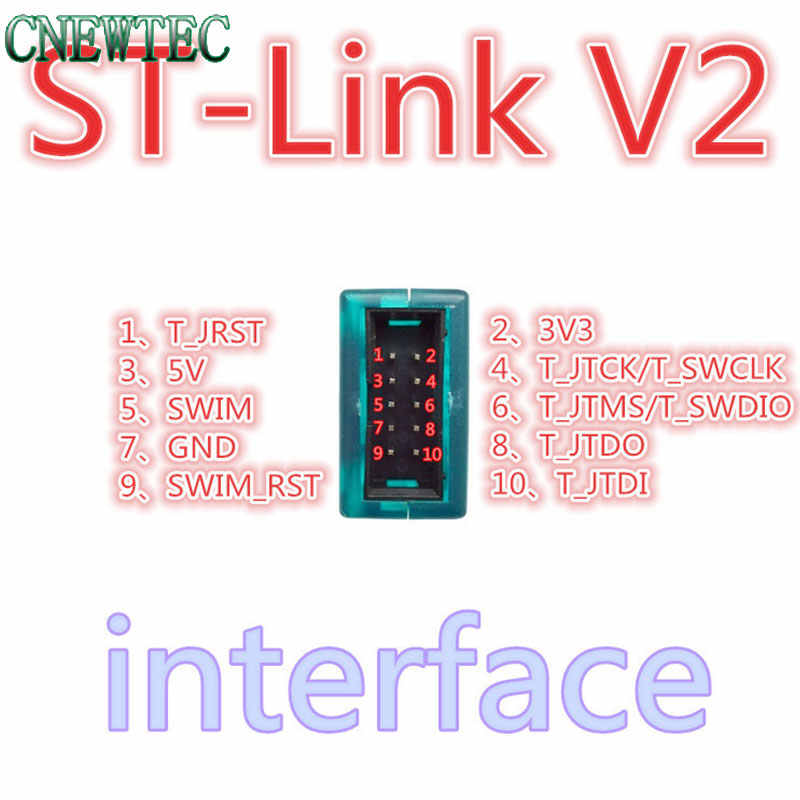
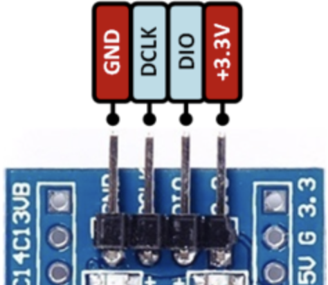
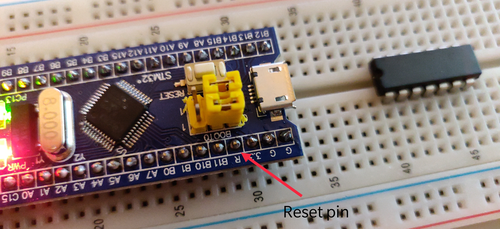
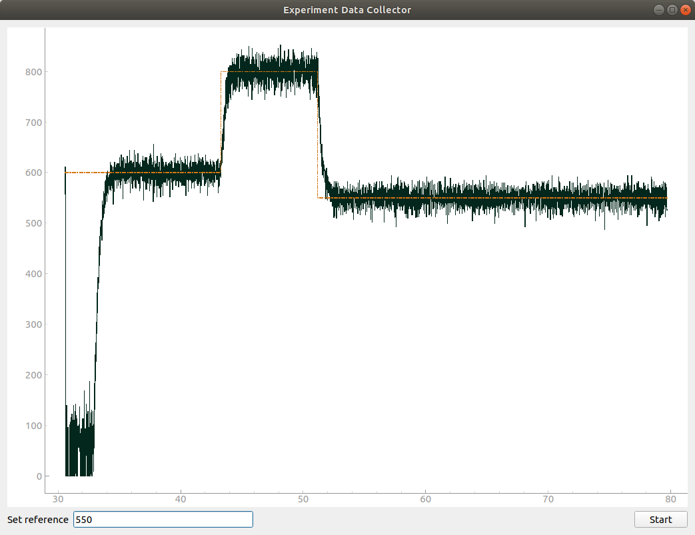
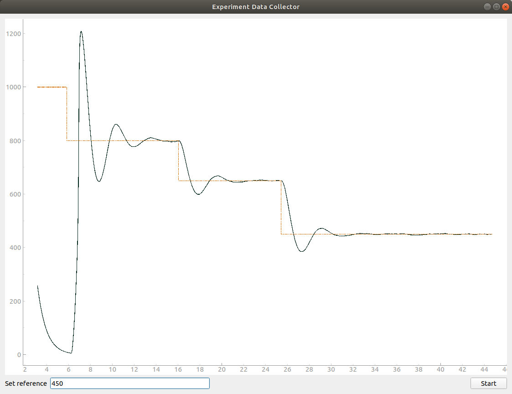

# DC Motor Control(PID)
Control of DC motor using the encoder and STM32F103 using Chibios

## Setting up
The STM32F103(Bluepill) has been used to achieve this project. It can either be programmed using [JTAG](https://www.aliexpress.com/i/1619197946.html?spm=2114.12057483.0.0.11a979f8zSeFl3) or can be done using UART.

The pinout of the cheap JTAG connector can be seen here



and the pinout of the SWD pins of the Bluepull can be seen here

. Connecting each pin to their respective other you should be able to program the board.

| ST-LinkV2        Bluepill |
|---------------------------|
| 3V3        ->      3V3    |
| T_SWCLK    ->     SWCLK   |
| T_SWDIO    ->     SWDIO   |
| GND        ->      GND    |

---
**NOTE**

It is important to note that the Chinese clones of Bluepill has a bootloader on them that prevents them to be programmed using SWD. But it can be easily overcome by connecting the 
`T_JRST` to `Reset` pin on Bluepill.



---

## IDE
The main IDE that I have used for the project is [VSCode](https://code.visualstudio.com/) as it has support for debugging cortex microcontrollers using the [Cortex-Debug](https://marketplace.visualstudio.com/items?itemName=marus25.cortex-debug) extension and also it is fast. 
The addition of CMake support can help using other IDEs such as [QtCreator](https://www.qt.io/product). A good
tutorial about setting up QtCreator can be found at [Debugging STM32 from QtCreator](https://www.bartslinger.com/cx-10-quadcopter/debugging-stm32-from-qtcreator/).
## Debugging
OpenOCD has been used for debugging. If you run into problems with OpenOCD saying that `Cannot halt device ..` then you might be using the cheap chinese STM32 microcontroller which have a different ID. If you look into [bluepill_openocd.cfg](bluepill_openocd.cfg) config file then you can see that I am also using a custom config file which contains the modified device ID.
You can copy and paste the contents of `target/stm32f1x.cfg` into a new file and modify the line 


```
      # this is the SW-DP tap id not the jtag tap id
      set _CPUTAPID 0x1ba01477
```

to

```

      # this is the SW-DP tap id not the jtag tap id
      set _CPUTAPID 0x2ba01477

```
## Results
The results doesn't seem promising due to the limited availablity os speed measurement using the Encoders as the 
MCU doesn't get time to process other things because of too many interrupts. If the interrupts are removed and the hardware
timers of STM32 are used in Quadrature encoder mode, then this problem can supposedly be solved. Another problem is that 
the RPM value calculated seems to be too noisy and the addition of low pass filter lead to overshooting as can be seen below.

Here is the result without any filtering of the RPM values


Here is the result by using a simple [low pass filter](LowpassFilter.hpp).


The results without filtering seem to correlate with the [simulation](https://github.com/parzival2/DC-Motor-Parameter-Estimation) done in Matlab. It would be interesting to see
the result and the tuned values after adding a low pass filter block.

## Todos
- [ ] Use low pass filter block and find the PID values
- [ ] Parse line instead of getting individual chars and converting to number
- [ ] Implement a GUI for tuning. 
